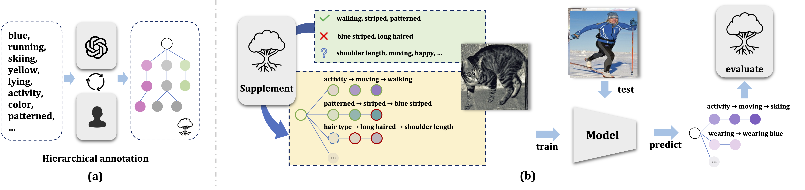
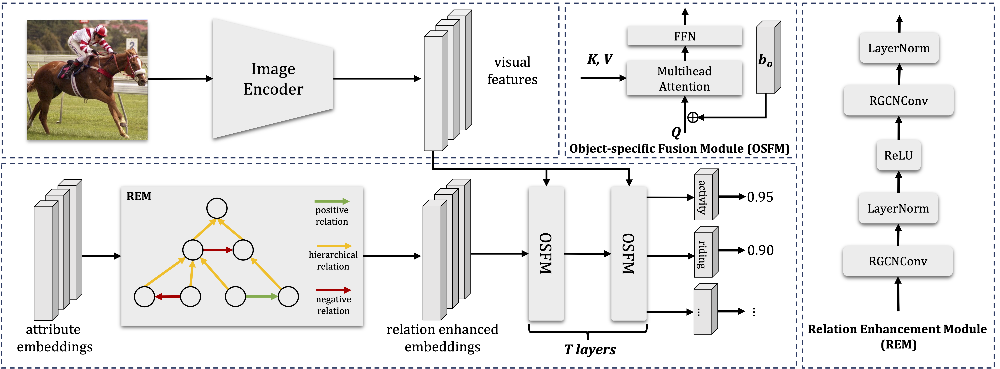

# Object-specific Attribute Relation Net
Project page for "Hierarchical Visual Attribute Learning in the Wild" (ACM MM 2023)


## Abstract 

Observing objects' attributes at different levels of detail is a fundamental aspect of how humans perceive and understand the world around them. Existing studies focused on attribute prediction in a flat way, but they overlook the underlying attribute hierarchy, e.g., navy blue is a subcategory of blue. In recent years, large language models, e.g., ChatGPT, have emerged with the ability to perform an extensive range of natural language processing tasks like text generation and classification. The factual knowledge learned by LLM can assist us build the hierarchical relations of visual attributes in the wild. Based on that, we propose a model called the object-specific attribute relation net, which takes advantage of three types of relations among attributes - positive, negative, and hierarchical - to better facilitate attribute recognition in images. Guided by the extracted hierarchical relations, our model can predict attributes from coarse to fine. Additionally, we introduce several evaluation metrics for attribute hierarchy to comprehensively assess the model's ability to comprehend hierarchical relations. Our extensive experiments demonstrate that our proposed hierarchical annotation brings improvements to the model's understanding of hierarchical relations of attributes, and the object-specific attribute relation net can recognize visual attributes more accurately.



## Model Architecture


## Prediction Visualization


## Preparation
1. Download relevant CLIP word embeddings at [Google Drive](https://drive.google.com/drive/folders/16m7M38DrFg3g6TadBIlJcBZFe-c7x-J3?usp=sharing), and put it under `data/embeddings/`.

2. Download relevant HVAW three types of adjacency matrix, the attribute index file `attribute_index.json`, the object index file `object_index`, and the long-tail partition file `head_tail.json` at [Google Drive](https://drive.google.com/drive/folders/16m7M38DrFg3g6TadBIlJcBZFe-c7x-J3?usp=sharing), and put them under `data/HVAW/data/`. Download the our trained model `osarn-model-highest.pth` and put it under `projects/osarn`.

3. Download [VAW dataset](https://github.com/adobe-research/vaw_dataset) and [VG 1.4 dataset](https://visualgenome.org/).

4. Download [Swin Transformer Pretrained Weight](https://github.com/microsoft/Swin-Transformer).

## Running

```bash
# train
CUDA_VISIBLE_DEVICES=0 python main.py --project projects/osarn --mode train

# test
CUDA_VISIBLE_DEVICES=0 python main.py --project projects/osarn --mode test
```


## Acknowledgement
Following works inspired us:
1. [Query2Label: A Simple Transformer Way to Multi-Label Classification](https://arxiv.org/abs/2107.10834)
2. [Multi-Label Image Recognition with Graph Convolutional Networks](https://arxiv.org/abs/1904.03582)
3. [Learning to Predict Visual Attributes in the Wild](https://openaccess.thecvf.com/content/CVPR2021/html/Pham_Learning_To_Predict_Visual_Attributes_in_the_Wild_CVPR_2021_paper.html)
4. [Asymmetric Loss For Multi-Label Classification]()


## Citation
If our work inspired you or help you, please consider citing it:
```
@inproceedings{10.1145/3581783.3612274,
author = {Liang, Kongming and Wang, Xinran and Zhang, Haiwen and Ma, Zhanyu and Guo, Jun},
title = {Hierarchical Visual Attribute Learning in the Wild},
year = {2023},
isbn = {9798400701085},
publisher = {Association for Computing Machinery},
address = {New York, NY, USA},
url = {https://doi.org/10.1145/3581783.3612274},
doi = {10.1145/3581783.3612274},
abstract = {Observing objects' attributes at different levels of detail is a fundamental aspect of how humans perceive and understand the world around them. Existing studies focused on attribute prediction in a flat way, but they overlook the underlying attribute hierarchy, e.g., navy blue is a subcategory of blue. In recent years, large language models, e.g., ChatGPT, have emerged with the ability to perform an extensive range of natural language processing tasks like text generation and classification. The factual knowledge learned by LLM can assist us build the hierarchical relations of visual attributes in the wild. Based on that, we propose a model called the object-specific attribute relation net, which takes advantage of three types of relations among attributes - positive, negative, and hierarchical - to better facilitate attribute recognition in images. Guided by the extracted hierarchical relations, our model can predict attributes from coarse to fine. Additionally, we introduce several evaluation metrics for attribute hierarchy to comprehensively assess the model's ability to comprehend hierarchical relations. Our extensive experiments demonstrate that our proposed hierarchical annotation brings improvements to the model's understanding of hierarchical relations of attributes, and the object-specific attribute relation net can recognize visual attributes more accurately.},
booktitle = {Proceedings of the 31st ACM International Conference on Multimedia},
pages = {3415–3423},
numpages = {9},
keywords = {hierarchical multi-label learning, large language model, attribute learning},
location = {Ottawa ON, Canada},
series = {MM '23}
}
```
