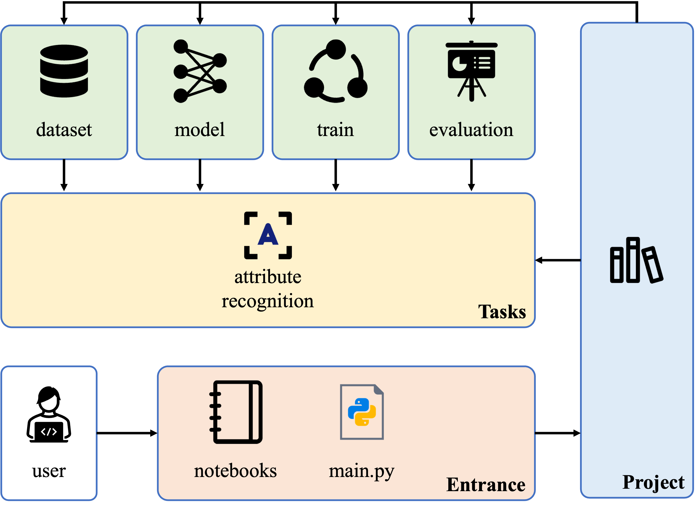

# Quick Guide

This is a quick guide to show you how to quick use the SEAL.

## Architecture

The entire SEAL architecture is as shown in the above diagram. SEAL is a project-oriented attribute learning library, where each project includes its corresponding task, dataset, model, training strategy, and evaluation strategy. Firstly, users initiate the process by running a script, such as, `main.py` and specifying the folder containing the project to be executed. Then, SEAL will  search for the corresponding JSON configuration file within the project directory, and use this configuration file to construct the pipeline for the specified task within the project.